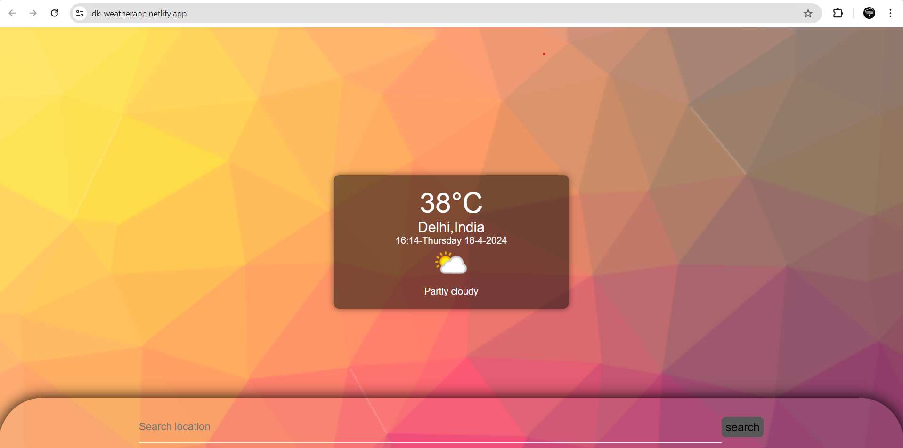

# Weather App

This Weather App is a simple web application that allows users to check the weather forecast for a specific location. It fetches weather data from a weather API using JavaScript's Fetch API.

## Features

- **Weather Forecast**: Provides current weather information such as temperature, humidity, wind speed, etc.
- **Location Search**: Users can search for weather information for any location worldwide.
- **Responsive Design**: The app is designed to work well on both desktop and mobile devices.

## Technologies Used

- HTML
- CSS
- JavaScript (Fetch API)

## Getting Started

To run the Weather App locally, follow these steps:

1. Clone this repository to your local machine.
2. Open the `index.html` file in your web browser.

Alternatively, you can [view the live demo here](https://dk-weatherapp.netlify.app/).

## Usage

1. Enter the name of the city or location you want to check the weather for in the search bar.
2. Press the "Search" button or hit Enter.
3. The app will display the current weather forecast for the entered location.
